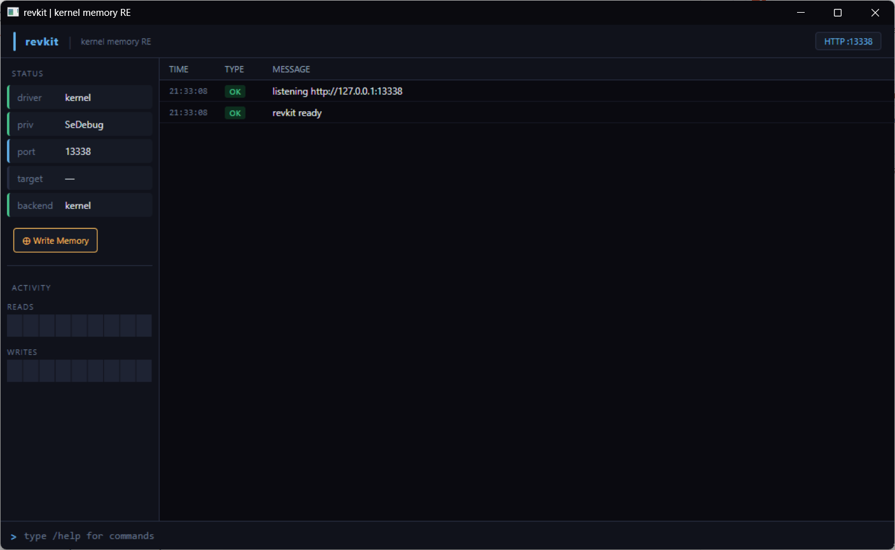

<div align="center">

```
██████â•- ███████â•-██â•-   ██â•-██â•-  ██â•-██â•-████████â•-
██╔══██â•-██╔════╝██║   ██║██║ ██╔╝██║╚══██╔══╝
██████╔╝█████â•-  ██║   ██║█████╔╝ ██║   ██║   
██╔══██â•-██╔══╝  ╚██â•- ██╔╝██╔═██â•- ██║   ██║   
██║  ██║███████â•- ╚████╔╝ ██║  ██â•-██║   ██║   
╚═╝  ╚═╝╚══════╝  ╚═══╝  ╚═╝  ╚═╝╚═╝   ╚═╝   
```

**kernel memory RE tool — MCP server for AI agents**


</div>

---

revkit is a Windows kernel-mode memory tool with a built-in [Model Context Protocol](https://modelcontextprotocol.io) server. It lets AI agents (Claude, GPT-4, Cursor, Windsurf, Codex, etc.) read and write process memory, disassemble code, parse PE headers, scan for patterns and strings — all from ring-0, bypassing the usual usermode restrictions.

Ships with a web-based UI built on WebView2.

<div align="center">

</div>

---

## what the driver does

The kernel driver (`revkit-driver.sys`) loads into ring-0 via kdmapper — it never touches the normal driver loading path (no INF, no service entry, no PatchGuard interaction). Once loaded it creates a device object (`\Device\RvKit`) that the usermode app communicates with over IOCTL.

From ring-0 it can:

- **Read process memory** — uses `MmCopyVirtualMemory` internally. No handle required, no `OpenProcess`, nothing visible in usermode. Works on protected processes (anti-cheat, DRM, system processes) that block `ReadProcessMemory`.

- **Write process memory** — two modes:
  - **Kernel copy** — `MmCopyVirtualMemory` into the target, same as read but writing. Fast, reliable.
  - **Physical PTE write** — walks the page table manually, remaps the physical page, writes directly. The target process never sees a write operation. No dirty page flags, no exception, nothing logged. This is what you use when the target scans its own memory or has write guards.

- **Query virtual memory** — `ZwQueryVirtualMemory` from kernel context. Gets base, size, protection, type, state of any region in any process.

- **Self-unload** — IOCTL 0x806 sends the driver an unload signal. It removes the symlink, deletes the device, and exits cleanly without a reboot.

### what it can be used for

- **Game reverse engineering** — read memory from games with anti-cheat (BattlEye, EAC, Vanguard). Most anti-cheats only block usermode; kernel reads are invisible to them.
- **Malware analysis** — inspect a running malware sample without touching it from usermode. Read its heap, stack, loaded modules.
- **DRM research** — read memory regions of protected processes that deny all usermode handles.
- **Fuzzing / instrumentation** — inject values into a running process mid-execution to observe behaviour without modifying the binary on disk.
- **AI-assisted RE** — the whole point of the MCP layer. Let Claude or any other agent drive the analysis. Ask it to find a function, follow a pointer chain, decode a struct — it calls the tools and gives you results in plain English.
- **Debugging without a debugger** — read process state from ring-0 when a debugger would be detected or is unavailable.

---

## features

- kernel read/write (ring-0, no handle needed)
- physical PTE stealth writes
- MCP HTTP server on localhost — any AI agent can connect
- web UI (WebView2 / Chromium) — real-time logs, activity graphs, write dialog
- x64 disassembler with full SSE/AVX opcode support
- PE parser — sections, exports, imports, full headers
- pattern scanner, value scanner, string scanner (ASCII + UTF-16)
- xref scanner — find all code that references an address
- pointer chain walker
- module list with base addresses and sizes

---

## requirements

### to run

| thing | notes |
|-------|-------|
| Windows 10 / 11 x64 | tested on Win11 22H2+ |
| Administrator | required — driver loading needs admin privileges |
| Microsoft Edge / WebView2 | already on most machines — if not, install the [WebView2 runtime](https://developer.microsoft.com/en-us/microsoft-edge/webview2/) |
| [kdmapper.exe](https://github.com/TheCruZ/kdmapper/releases) | place next to `revkit.exe` |

**No test signing required.** kdmapper loads the driver by exploiting a signed vulnerable Intel driver, bypassing Windows driver signature enforcement entirely. No bcdedit, no reboots, no BIOS changes.

---

## setup

### files you need

```
revkit.exe            — main application
revkit-driver.sys     — kernel driver (built from source)
kdmapper.exe          — driver loader (get from TheCruZ/kdmapper)
WebView2Loader.dll    — WebView2 bootstrap (included in release)
app.html              — web UI (included in release)
```

All files must be in the same folder. Run `revkit.exe` as Administrator. The driver loads automatically on startup.

### MCP config

Paste this into your AI agent's config file. For Claude Code it's `~/.claude.json`, for Cursor/Windsurf it's in their MCP settings.

```json
{
  "mcpServers": {
    "revkit": {
      "command": "C:\\path\\to\\revkit.exe",
      "args": []
    }
  }
}
```

Replace the path with wherever your `revkit.exe` lives. The agent will start revkit automatically when it needs it.

---

## tools reference

| tool | what it does |
|------|-------------|
| `process_attach` | attach to a process by name or PID |
| `process_detach` | detach from current process |
| `process_list` | list all running processes with PID and path |
| `process_status` | check current attach state |
| `module_list` | all loaded modules with base address and size |
| `module_find` | find a specific module by name |
| `module_info_full` | detailed PE info for a loaded module |
| `memory_read` | read bytes at an address, returns hex dump |
| `memory_write` | write bytes via kernel copy |
| `memory_write_physical` | write via PTE — stealth, leaves no trace |
| `memory_query` | query a single region (base, size, protect, type) |
| `memory_regions` | list all mapped regions in the process |
| `memory_scan` | scan for a byte pattern with wildcards |
| `value_scan` | scan for a typed value (float, int, etc.) |
| `string_scan` | scan for ASCII or UTF-16 strings |
| `xref_scan` | find all addresses that reference a given address |
| `pointer_chain` | walk a chain of offsets from a base address |
| `pe_info` | parse PE headers at an address |
| `pe_exports` | dump the export table |
| `pe_imports` | dump the import table |
| `pe_sections` | list PE sections with addresses and flags |
| `disassemble` | disassemble x64 instructions at an address |

---

## example session

Attach to a process, find a module, read and disassemble it:

```
process_attach  →  name: "target.exe"
module_list     →  find "engine.dll" at 0x7FF800000000
memory_read     →  address: 0x7FF800000000, size: 64    ← PE header
pe_exports      →  address: 0x7FF800000000              ← export table
disassemble     →  address: 0x7FF800401234, count: 30   ← function
pointer_chain   →  base: 0x7FF900000000, offsets: [0x10, 0x28, 0x8]
```

---

## dev section

### architecture

```
revkit.exe
├── WebView2 window          ← Chromium renders app.html
│   └── JS ←→ C++ bridge    ← PostWebMessageAsString / addEventListener
├── HTTP server (:13338)     ← JSON-RPC 2.0 (MCP protocol)
│   └── tool dispatch        ← routes tool calls to handlers
└── driver backend
    ├── IOCTL client         ← sends requests to \Device\RvKit
    └── fallback (RPM)       ← ReadProcessMemory if driver not loaded
```

### driver internals

The driver is a minimal kernel module — no WDF, no WDM framework, just direct NT APIs.

**Entry point** — `DriverEntry` is called by kdmapper with `DriverObject == NULL` (kdmapper doesn't go through the normal driver init path). The driver detects this and calls `IoCreateDriver` manually to get a real DriverObject, then calls DriverEntry again with it.

**Device creation** — tries `\Device\RvKit` through `\Device\RvKit4` in sequence. If a stale device exists from a previous crash it deletes it and recreates. Creates `\DosDevices\Global\RvKit` symlink so usermode can open `\\.\RvKit`.

**IOCTL dispatch** — all ops go through one DeviceControl handler:

| IOCTL | operation |
|-------|-----------|
| 0x801 | attach — store target EPROCESS pointer |
| 0x802 | detach — release EPROCESS reference |
| 0x803 | read — `MmCopyVirtualMemory` from target |
| 0x804 | write — `MmCopyVirtualMemory` into target |
| 0x805 | query — `ZwQueryVirtualMemory` on target |
| 0x806 | unload — self-destruct, remove device + symlink |
| 0x80D | physical write — PTE remap + write |

**Physical write path** — `MmGetVirtualForPhysical` / `MmGetPhysicalAddress` to find the physical frame, then temporarily maps it into kernel address space, writes the bytes, flushes TLB. The target process page tables are modified directly — no copy-on-write, no dirty bit from the target's perspective.

**Unload** — `DriverSelfUnload` deletes the symlink, derefs the EPROCESS, marks dispatch slots as `DeviceOffline` (returns `STATUS_DEVICE_NOT_CONNECTED`) rather than crashing any in-flight IRPs, then returns. kdmapper handles the actual memory cleanup.

### MCP server

The HTTP server is a minimal Winsock TCP server parsing raw HTTP/1.1. It speaks [JSON-RPC 2.0](https://www.jsonrpc.org/specification) and follows the [MCP spec](https://spec.modelcontextprotocol.io). Tools are registered at startup, each with a JSON schema describing its arguments. When a `tools/call` request comes in it validates arguments against the schema, calls the handler, and returns the result.

The server runs on a background thread. All driver calls happen synchronously on that thread — no async needed since reads are fast.

### UI bridge

The WebView2 window loads `app.html` from disk (same directory as the exe). C++ pushes events to JS via `ICoreWebView2::PostWebMessageAsString` with a JSON payload. JS sends commands back via `window.chrome.webview.postMessage`. The bridge is one-way push from C++ for logs/status, and command messages from JS for user input.

### adding a tool

1. Add the schema and handler in `src/mcp/tools/` (follow existing pattern)
2. Register it in `src/mcp/server.cpp`
3. Add the IOCTL if it needs a new kernel op, or reuse existing ones

The handler receives a `nlohmann::json` args object and returns a `nlohmann::json` result. Errors are thrown as `std::runtime_error`.

### building from source

Requirements:
- Visual Studio 2019 or 2022 with **MSVC v142** toolset
- Windows SDK 10.0.26100 or later
- Windows Driver Kit (WDK) matching your SDK — for the driver project only
- No other dependencies (nlohmann/json and WebView2 SDK are vendored)

```bat
# open revkit.sln
# set configuration to Release | x64
# build solution (Ctrl+Shift+B)
```

Post-build automatically copies `WebView2Loader.dll`, `app.html`, `revkit-driver.sys`, and `kdmapper.exe` (from `tools/`) to `bin\Release\`.

To rebuild the driver separately:

```bat
msbuild driver\revkit-driver.vcxproj /p:Configuration=Release /p:Platform=x64
```

---

## notes

- `memory_write_physical` modifies PTEs directly. If you write to the wrong address the system will bugcheck. Double-check your target address before using it.
- Always `process_detach` before the target exits. The driver holds an EPROCESS reference — if the process dies with the reference held it will cause a BSOD on next access.
- The driver is unsigned but kdmapper handles that. No test signing needed.
- Some anti-cheat systems (Vanguard, FaceIT) run their own kernel drivers that may detect or block revkit's driver. Nothing guarantees stealth against ring-0 AV/AC.

---

<div align="center">
MIT license — use it, break it, improve it
</div>


